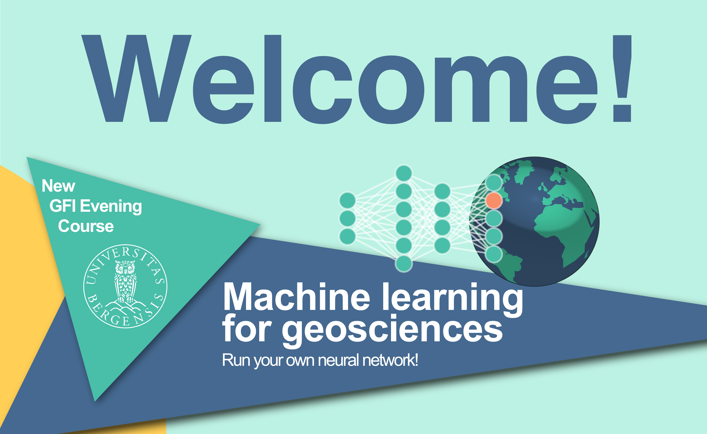

I co-designed and taught an evening course on Machine Learning for Geosciences at the University of Bergen, for all students from year 1 undergraduate to PhD students. This course was part of the CoCreate project.

Read more here: [CoCreate project website](https://cocreatinggfi.w.uib.no/gfi-evening-courses/)
Nathapron Phuchat, Benjamin Aarø, Kjersti Birkeland Daae and Nilgun Kulan.
